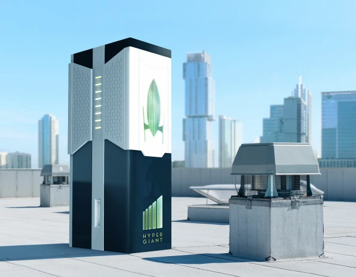

Carbon Sequestration
=====================

.. image:: images/blankspace.png
     :align: center

Future bioreactor - In the future, the corporates might have an extra appliance next to the copy machine and the refrigerator: an algae bioreactor. Designed to fit inside offices and eventually sit on the rooftops throughout cities, it can capture as much carbon from the atmosphere as an acre of trees.
Inside the bioreactor, algae does the work. Amazing thing about algae is it’s really cheap and it’s easy to grow—the core things it needs are sunlight, CO2, and water.
Because algae grows much more quickly than trees,  optimizes the algae’s ability to capture CO2, can sequester around two tons of carbon out of the air each year.

